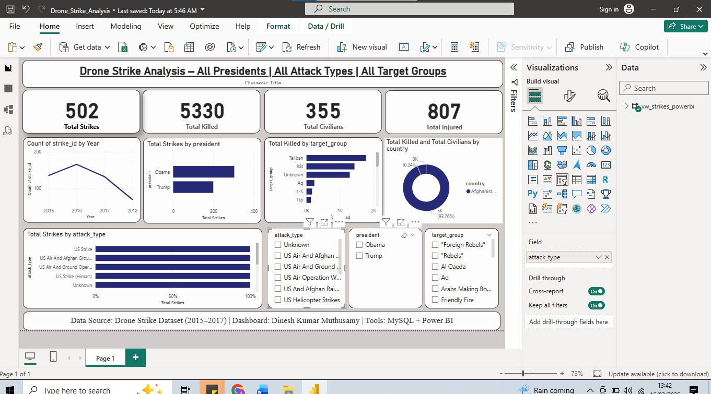
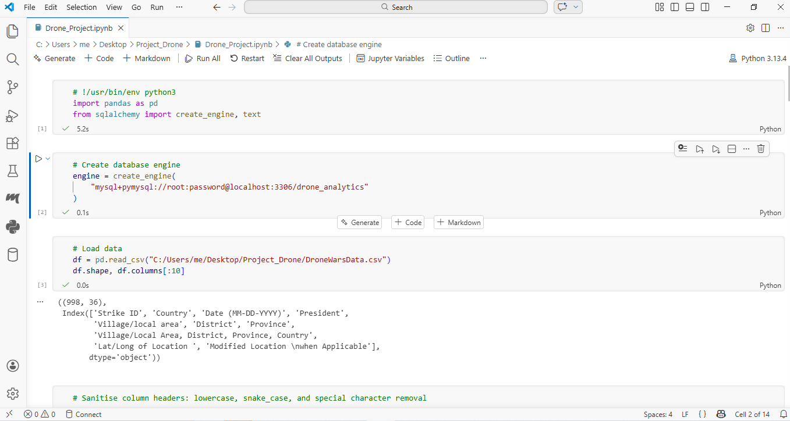
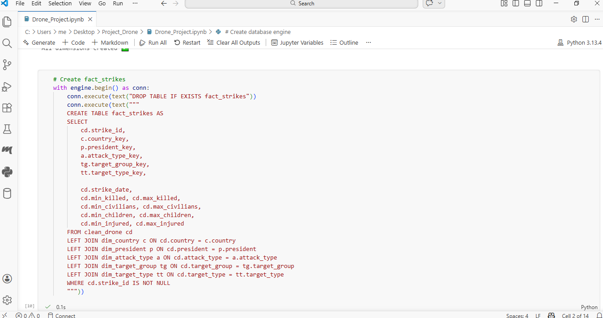
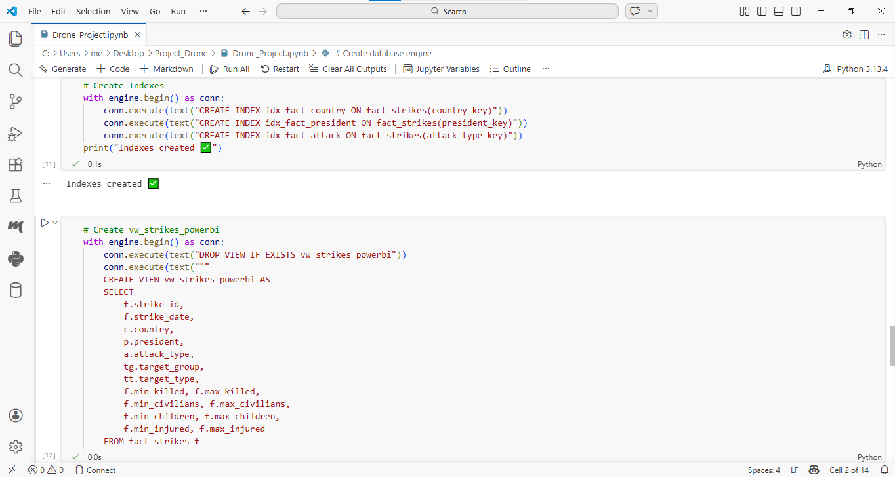

# Drone Strike Analysis Dashboard

An end-to-end data analytics project analyzing drone strike operations using **Python, MySQL, and Power BI**.

This project demonstrates:

- Python data cleaning and transformation
- SQL data modeling using a **Star Schema**
- KPI reporting
- Interactive Power BI dashboard development

---

## Project Workflow

This project follows a typical **data analytics pipeline** used in BI projects.

Raw Dataset → Python Data Processing → MySQL Data Modeling → Power BI Dashboard

The goal is to transform raw operational data into clear insights and decision-support metrics.

---

## Dashboard Preview

The dashboard presents key operational insights including strike activity, casualties, and target distribution.

---

## Dashboard KPIs

The dashboard highlights important metrics:

| KPI | Description |
|----|----|
| Total Strikes | Total number of drone strike events |
| Total Killed | Estimated number of casualties |
| Total Civilians | Civilian casualty count |
| Total Injured | Total injured reported |

---

## Dashboard Insights

The dashboard helps analyze:

- Strike trends over time
- Strike activity by U.S. president
- Casualty distribution by target group
- Strike distribution by attack type
- Country-level strike analysis

Interactive Power BI slicers allow filtering by:

- Attack Type
- President
- Target Group

---

## Data Modeling

A **Star Schema** was implemented in MySQL to support efficient analytics.

### Fact Table
`fact_strikes`

### Dimension Tables

- `dim_country`
- `dim_president`
- `dim_attack_type`
- `dim_target_group`
- `dim_target_type`
- `dim_date`

---

## MySQL Database Schema

The schema separates **fact and dimension tables**, improving query performance and BI modeling.

---

## Fact Table Structure

The fact table stores:

- strike_id
- country_key
- president_key
- attack_type_key
- target_group_key
- casualty metrics

---

## Power BI Reporting View

A reporting view simplifies queries for Power BI.

`vw_strikes_powerbi`

This view joins fact and dimension tables to create a BI-ready dataset.

---

## Technologies Used

- Python
- Pandas
- SQLAlchemy
- MySQL
- Power BI
- DAX
- Jupyter Notebook

---

## Skills Demonstrated

- Data Cleaning and Transformation
- SQL Data Modeling (Star Schema)
- KPI Dashboard Development
- Power BI Data Visualization
- DAX Measures
- End-to-End Data Analytics Workflow

---

## Data Source

Drone Wars Database

https://dronewars.github.io/data/

The dataset aggregates drone strike information compiled by the **Bureau of Investigative Journalism**.

---

## Author

**Dinesh Kumar Muthusamy**

Data Analyst | Business Intelligence | Power BI | SQL | Python | MySQL | Data Modeling

LinkedIn  
https://www.linkedin.com/in/dinesh-kumar-muthusamy-856399333
